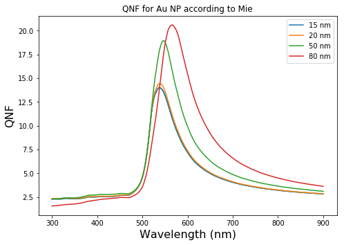

# Looking at AgAu 15nm dimer

This is going to be a document where I plot real data and can be used as an example for others to use as they get started on their own project.


```python
#this is plotting the near-field contained in average_Espehres.txt
import pandas as pd
import numpy as np
import matplotlib.pyplot as plt

from pylab import *

#Path to the data you want to plot
filename = '/home/bldrdge1/data/AgAu/dimer/15nm/2nm/average_Esphere.txt'
filename2 = '/home/bldrdge1/data/AgAu/dimer/15nm/4nm/average_Esphere.txt'
filename3 = '/home/bldrdge1/data/AgAu/dimer/15nm/6nm/average_Esphere.txt'
filename4 = '/home/bldrdge1/data/AgAu/dimer/15nm/8nm/average_Esphere.txt'
filename5 = '/home/bldrdge1/data/AgAu/dimer/15nm/10nm/average_Esphere.txt'

#This reads in the data and skips the first row of header info
data = pd.read_csv(filename, sep='\t', header=None, skiprows=1).values
data2 = pd.read_csv(filename2, sep='\t', header=None, skiprows=1).values
data3 = pd.read_csv(filename3, sep='\t', header=None, skiprows=1).values
data4 = pd.read_csv(filename4, sep='\t', header=None, skiprows=1).values
data5 = pd.read_csv(filename5, sep='\t', header=None, skiprows=1).values

#Choose which columns to plot. for extabs_txt,
#Lambda = 0, E^2 = 6, E^4 = 7, etc.
x = data[:,0]
y = data[:,6]

x2 = data2[:,0]
y2 = data2[:,6]

x3 = data3[:,0]
y3 = data3[:,6]

x4 = data4[:,0]
y4 = data4[:,6]

x5 = data5[:,0]
y5 = data5[:,6]

fig = plt.figure()

axes = fig.add_axes([0.0, 0.0, 1.0, 1.0]) # left, bottom, width, height (range 0 to 1)

axes.plot(x, y, 'r')

axes.set_xlabel('Wavelength (nm)', fontsize=16)
axes.set_ylabel('E^2', fontsize=16)
axes.set_title('Near-Field E^2 on Au NPs in Ag-Au dimer, 15nm diameter', fontsize=12);

plt.plot(x, y, '*-',label = "2 nm" )
plt.plot(x2, y2,'*-',label = "4 nm")
plt.plot(x3, y3, '*-', label = "6 nm")
plt.plot(x4, y4,'*-', label = "8 nm")
plt.plot(x5, y5,'*-', label = "10 nm")
#plt.plot(x11, y11, label = "2 nm - 50NP")

plt.legend(loc=1)

plt.xlim([300, 700])

plt.show()
```


```python
#now lets look at EXT on Au nanoparticles stored inaverage_EXTABS_sphere.txt
import pandas as pd
import numpy as np
import matplotlib.pyplot as plt

from pylab import *

#Path to the data you want to plot
filename_ext1 = '/home/bldrdge1/data/AgAu/dimer/15nm/2nm/average_EXTABS_sphere.txt'
filename_ext2 = '/home/bldrdge1/data/AgAu/dimer/15nm/4nm/average_EXTABS_sphere.txt'
filename_ext3 = '/home/bldrdge1/data/AgAu/dimer/15nm/6nm/average_EXTABS_sphere.txt'
filename_ext4 = '/home/bldrdge1/data/AgAu/dimer/15nm/8nm/average_EXTABS_sphere.txt'
filename_ext5 = '/home/bldrdge1/data/AgAu/dimer/15nm/10nm/average_EXTABS_sphere.txt'
filename_monomer='/home/ywang/ddscat/Au_sphere/NIH_project/Au_singlesphere/Au_sphere_15nm/monomer/lat50_2/orientation_avg.txt'

#This reads in the data and skips the first row of header info
data_ext1 = pd.read_csv(filename_ext1, sep='\t', header=None, skiprows=1).values
data_ext2 = pd.read_csv(filename_ext2, sep='\t', header=None, skiprows=1).values
data_ext3 = pd.read_csv(filename_ext3, sep='\t', header=None, skiprows=1).values
data_ext4 = pd.read_csv(filename_ext4, sep='\t', header=None, skiprows=1).values
data_ext5 = pd.read_csv(filename_ext5, sep='\t', header=None, skiprows=1).values
data_monomer = pd.read_csv(filename_monomer,sep='\t', header=None, skiprows=1).values 

#Choose which columns to plot
#Lambda = 0, EXT1 = 5, Abs1 = 6, etc.
x = data_ext1[:,0]
y = data_ext1[:,6]

x2 = data_ext2[:,0]
y2 = data_ext2[:,6]

x3 = data_ext3[:,0]
y3 = data_ext3[:,6]

x4 = data_ext4[:,0]
y4 = data_ext4[:,6]

x5 = data_ext5[:,0]
y5 = data_ext5[:,6]

x6 = data_monomer[:,0]
y6 = data_monomer[:,2]

fig = plt.figure()

axes = fig.add_axes([0.0, 0.0, 1.0, 1.0]) # left, bottom, width, height (range 0 to 1)

axes.plot(x, y, 'r')

axes.set_xlabel('Wavelength (nm)', fontsize=16)
axes.set_ylabel('Qabs', fontsize=16)
axes.set_title('Qabs on Au NPs in Ag-Au dimer, 15nm diameter', fontsize=12);
axes.set_title('Qabs on Au NPs normalized by pi*aeff^2, 15nm diameter', fontsize=12);

plt.plot(x, y/(3.14156*0.0075**2), '*-',label = "2 nm" )
plt.plot(x2, y2/(3.14156*0.0075**2),'*-',label = "4 nm")
plt.plot(x3, y3/(3.14156*0.0075**2), '*-', label = "6 nm")
plt.plot(x4, y4/(3.14156*0.0075**2),'*-', label = "8 nm")
plt.plot(x5, y5/(3.14156*0.0075**2),'*-', label = "10 nm")
plt.plot(x6, y6, '--', label = "monomer")

plt.legend(loc=1)

plt.xlim([300, 700])

plt.show()
```





```python
#Now plot Qext on Au NPs
#Lambda = 0, EXT1 = 5, Abs1 = 6, etc.
x = data_ext1[:,0]
y = data_ext1[:,5]

x2 = data_ext2[:,0]
y2 = data_ext2[:,5]

x3 = data_ext3[:,0]
y3 = data_ext3[:,5]

x4 = data_ext4[:,0]
y4 = data_ext4[:,5]

x5 = data_ext5[:,0]
y5 = data_ext5[:,5]

x6 = data_monomer[:,0]
y6 = data_monomer[:,1]

fig = plt.figure()

axes = fig.add_axes([0.0, 0.0, 1.0, 1.0]) # left, bottom, width, height (range 0 to 1)

axes.plot(x, y, 'r')

axes.set_xlabel('Wavelength (nm)', fontsize=16)
axes.set_ylabel('Qext', fontsize=16)
axes.set_title('Qext on Au NPs in Ag-Au dimer, 15nm diameter', fontsize=12);

plt.plot(x, y/(3.14156*0.0075**2), '*-',label = "2 nm" )
plt.plot(x2, y2/(3.14156*0.0075**2),'*-',label = "4 nm")
plt.plot(x3, y3/(3.14156*0.0075**2), '*-', label = "6 nm")
plt.plot(x4, y4/(3.14156*0.0075**2),'*-', label = "8 nm")
plt.plot(x5, y5/(3.14156*0.0075**2),'*-', label = "10 nm")
plt.plot(x6, y6, '--', label = "monomer")

plt.legend(loc=1)

plt.xlim([300, 700])

plt.show()

```


On the Au NPs, I checked the data, Qext is less than Qabs. But on the Ag NPs, Qext is greater than Qabs. WHen you add Qext on Ag and Au together, it gives consistent resutls as the Qext calculated together and recorded in orientation.txt file. The Qabs also added up correctly.  
