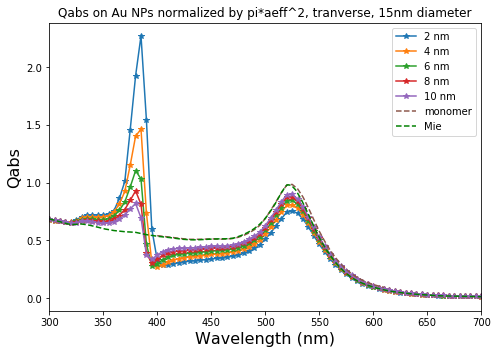

# Looking at AgAu 15nm dimer

The raw code for this IPython notebook is by default hidden for easier reading.To toggle on/off the raw code, click <a href="javascript:code_toggle()"> here</a> 


```python
import pandas as pd
import numpy as np
import matplotlib.pyplot as plt

from pylab import *

#Path to the data you want to plot
miefile = '/home/ywang/ddscat/Au_sphere/NIH_project/Au_mie_JC_every1nm_upadtedYWang.csv'
datamie = pd.read_csv(miefile, sep=',', skiprows=1).values
xmie = datamie[:,0]
ymie = datamie[:,5]
x2 = datamie[:,0]
y2 = datamie[:,6]
x3 = datamie[:,0]
y3 = datamie[:,7]
x4 = datamie[:,0]
y4 = datamie[:,8]
#Mie data excel file is stored, lamda, NF_15nm, NF_20nm, NF_50nm, NF_80nm, Ext_15,Ext20,Ext_50,Ext_80, ABs_15nm, so on last is scat.
fig = plt.figure()

axes = fig.add_axes([0.0, 0.0, 1.0, 1.0]) # left, bottom, width, height (range 0 to 1)

axes.plot(xmie, ymie, 'g')

axes.set_xlabel('Wavelength (nm)', fontsize=16)
axes.set_ylabel('Qext', fontsize=16)
axes.set_title('Qext for Au NP according to Mie', fontsize=12);

plt.plot(xmie, ymie, '-',label = "15 nm" )
plt.plot(x2, y2, '-',label = "20 nm" )
plt.plot(x2, y3, '-',label = "50 nm" )
plt.plot(x2, y4, '-',label = "80 nm" )
plt.legend(loc=1)

plt.show()

```


    <Figure size 640x480 with 1 Axes>


```python
xmie = datamie[:,0]
ymie = datamie[:,1]
y2 = datamie[:,2]
y3 = datamie[:,3]
y4 = datamie[:,4]
#Mie data excel file is stored, lamda, NF_15nm, NF_20nm, NF_50nm, NF_80nm, Ext_15,Ext20,Ext_50,Ext_80, ABs_15nm, so on last is scat.
fig = plt.figure()

axes = fig.add_axes([0.0, 0.0, 1.0, 1.0]) # left, bottom, width, height (range 0 to 1)

axes.plot(xmie, ymie, 'g')

axes.set_xlabel('Wavelength (nm)', fontsize=16)
axes.set_ylabel('QNF', fontsize=16)
axes.set_title('QNF for Au NP according to Mie', fontsize=12);

plt.plot(xmie, ymie, '-',label = "15 nm" )
plt.plot(xmie, y2, '-',label = "20 nm" )
plt.plot(xmie, y3, '-',label = "50 nm" )
plt.plot(xmie, y4, '-',label = "80 nm" )
plt.legend(loc=1)
plt.show()

```


```python
#this is plotting the near-field contained in average_Espehres.txt
import pandas as pd
import numpy as np
import matplotlib.pyplot as plt

from pylab import *

#Path to the data you want to plot
filename = '/home/bldrdge1/data/AgAu/dimer/15nm/2nm/average_Esphere.txt'
filename2 = '/home/bldrdge1/data/AgAu/dimer/15nm/4nm/average_Esphere.txt'
filename3 = '/home/bldrdge1/data/AgAu/dimer/15nm/6nm/average_Esphere.txt'
filename4 = '/home/bldrdge1/data/AgAu/dimer/15nm/8nm/average_Esphere.txt'
filename5 = '/home/bldrdge1/data/AgAu/dimer/15nm/10nm/average_Esphere.txt'
fileNF_monomer='/home/ywang/ddscat/Au_sphere/NIH_project/Au_singlesphere/Au_sphere_15nm/monomer/lat50_2/average_Esphere.txt'

#This reads in the data and skips the first row of header info
data = pd.read_csv(filename, sep='\t', header=None, skiprows=1).values
data2 = pd.read_csv(filename2, sep='\t', header=None, skiprows=1).values
data3 = pd.read_csv(filename3, sep='\t', header=None, skiprows=1).values
data4 = pd.read_csv(filename4, sep='\t', header=None, skiprows=1).values
data5 = pd.read_csv(filename5, sep='\t', header=None, skiprows=1).values
dataNF_monomer = pd.read_csv(fileNF_monomer, sep='\t', header=None, skiprows=1).values

#Choose which columns to plot. for extabs_txt,
#Lambda = 0, E^2 = 6, E^4 = 7, etc.
x = data[:,0]
y = data[:,6]

x2 = data2[:,0]
y2 = data2[:,6]

x3 = data3[:,0]
y3 = data3[:,6]

x4 = data4[:,0]
y4 = data4[:,6]

x5 = data5[:,0]
y5 = data5[:,6]
xmonomer = dataNF_monomer[:,0]
ymonomer = dataNF_monomer[:,6]
xnfmie = datamie[:,0]
ynfmie = datamie[:,1]

fig = plt.figure()

axes = fig.add_axes([0.0, 0.0, 1.0, 1.0]) # left, bottom, width, height (range 0 to 1)

axes.set_xlabel('Wavelength (nm)', fontsize=16)
axes.set_ylabel('E^2', fontsize=16)
axes.set_title('Near-Field E^2 on Au NPs in Ag-Au dimer, 15nm diameter', fontsize=12);

plt.plot(x, y, '*-',label = "2 nm" )
plt.plot(x2, y2, '*-',label = "4 nm" )
plt.plot(x3, y3, '*-',label = "6 nm" )
plt.plot(x4, y4, '*-',label = "8 nm" )
plt.plot(x5, y5, '*-',label = "10 nm" )
plt.plot(xmonomer, ymonomer, '+--',label = "Monomer Lat50_2" )
plt.plot(xnfmie, ynfmie, 'g--',label = "Mie" )


plt.legend(loc=1)

plt.xlim([300, 700])

```


    (300, 700)


The above is looking at the longitudinal mode. 


```python
fig = plt.figure()

axes = fig.add_axes([0.0, 0.0, 1.0, 1.0]) # left, bottom, width, height (range 0 to 1)

axes.set_xlabel('Wavelength (nm)', fontsize=16)
axes.set_ylabel('E^2', fontsize=16)
axes.set_title('Near-Field E^2, transverse mode on Au NPs in Ag-Au dimer, 15nm diameter', fontsize=12);

lamda=data[:,0]
y=data[:,14]
y2=data2[:,14]
y3=data3[:,14]
y4=data4[:,14]

plt.plot(lamda,y,'*-',label = "2 nm" )
plt.plot(lamda, y2, '*-',label = "4 nm" )
plt.plot(lamda, y3, '*-',label = "6 nm" )
plt.plot(lamda, y4, '*-',label = "8 nm" )
plt.plot(lamda, y5, '*-',label = "10 nm" )
plt.plot(xmonomer, ymonomer, '+--',label = "Monomer Lat50_2" )
plt.plot(xnfmie, ynfmie, 'g--',label = "Mie" )

plt.legend(loc=1)

plt.xlim([300, 700])

```


    (300, 700)


```python
#now lets look at EXT on Au nanoparticles stored inaverage_EXTABS_sphere.txt
import pandas as pd
import numpy as np
import matplotlib.pyplot as plt

from pylab import *

#Path to the data you want to plot
filename_ext1 = '/home/bldrdge1/data/AgAu/dimer/15nm/2nm/average_EXTABS_sphere.txt'
filename_ext2 = '/home/bldrdge1/data/AgAu/dimer/15nm/4nm/average_EXTABS_sphere.txt'
filename_ext3 = '/home/bldrdge1/data/AgAu/dimer/15nm/6nm/average_EXTABS_sphere.txt'
filename_ext4 = '/home/bldrdge1/data/AgAu/dimer/15nm/8nm/average_EXTABS_sphere.txt'
filename_ext5 = '/home/bldrdge1/data/AgAu/dimer/15nm/10nm/average_EXTABS_sphere.txt'
filename_monomer='/home/ywang/ddscat/Au_sphere/NIH_project/Au_singlesphere/Au_sphere_15nm/monomer/lat50_2/orientation_avg.txt'

#This reads in the data and skips the first row of header info
data_ext1 = pd.read_csv(filename_ext1, sep='\t', header=None, skiprows=1).values
data_ext2 = pd.read_csv(filename_ext2, sep='\t', header=None, skiprows=1).values
data_ext3 = pd.read_csv(filename_ext3, sep='\t', header=None, skiprows=1).values
data_ext4 = pd.read_csv(filename_ext4, sep='\t', header=None, skiprows=1).values
data_ext5 = pd.read_csv(filename_ext5, sep='\t', header=None, skiprows=1).values
data_monomer = pd.read_csv(filename_monomer,sep='\t', header=None, skiprows=1).values 

#Choose which columns to plot
#Lambda = 0, EXT1 = 5, Abs1 = 6, etc.
x = data_ext1[:,0]
y = data_ext1[:,6]

x2 = data_ext2[:,0]
y2 = data_ext2[:,6]

x3 = data_ext3[:,0]
y3 = data_ext3[:,6]

x4 = data_ext4[:,0]
y4 = data_ext4[:,6]

x5 = data_ext5[:,0]
y5 = data_ext5[:,6]

x6 = data_monomer[:,0]
y6 = data_monomer[:,2]
xmie = datamie[:,0]
ymie = datamie[:,9]

fig = plt.figure()

axes = fig.add_axes([0.0, 0.0, 1.0, 1.0]) # left, bottom, width, height (range 0 to 1)


axes.set_xlabel('Wavelength (nm)', fontsize=16)
axes.set_ylabel('Qabs', fontsize=16)
axes.set_title('Qabs on Au NPs in Ag-Au dimer, 15nm diameter', fontsize=12);
axes.set_title('Qabs on Au NPs normalized by pi*aeff^2, 15nm diameter', fontsize=12);

plt.plot(x, y/(3.14156*0.0075**2), '*-',label = "2 nm" )
plt.plot(x2, y2/(3.14156*0.0075**2),'*-',label = "4 nm")
plt.plot(x3, y3/(3.14156*0.0075**2), '*-', label = "6 nm")
plt.plot(x4, y4/(3.14156*0.0075**2),'*-', label = "8 nm")
plt.plot(x5, y5/(3.14156*0.0075**2),'*-', label = "10 nm")
plt.plot(x6, y6, '--', label = "monomer")
plt.plot(xmie, ymie, 'g--', label = "Mie")

plt.legend(loc=1)

plt.xlim([300, 700])

plt.show()
```


The above is longitudinal mode


```python
#Now look at tranverse mode Absorption effect. 
#Lambda = 0, EXT1 = 5, Abs1 = 6, EXT2 is on Ag, Abs2, EXT-tranverse mode.
x = data_ext1[:,0]
y = data_ext1[:,10]

x2 = data_ext2[:,0]
y2 = data_ext2[:,10]

x3 = data_ext3[:,0]
y3 = data_ext3[:,10]

x4 = data_ext4[:,0]
y4 = data_ext4[:,10]

x5 = data_ext5[:,0]
y5 = data_ext5[:,10]

x6 = data_monomer[:,0]
y6 = data_monomer[:,2]
xmie = datamie[:,0]
ymie = datamie[:,9]

fig = plt.figure()

axes = fig.add_axes([0.0, 0.0, 1.0, 1.0]) # left, bottom, width, height (range 0 to 1)


axes.set_xlabel('Wavelength (nm)', fontsize=16)
axes.set_ylabel('Qabs', fontsize=16)
axes.set_title('Qabs on Au NPs in Ag-Au dimer,15nm diameter', fontsize=12);
axes.set_title('Qabs on Au NPs normalized by pi*aeff^2, tranverse, 15nm diameter', fontsize=12);

plt.plot(x, y/(3.14156*0.0075**2), '*-',label = "2 nm" )
plt.plot(x2, y2/(3.14156*0.0075**2),'*-',label = "4 nm")
plt.plot(x3, y3/(3.14156*0.0075**2), '*-', label = "6 nm")
plt.plot(x4, y4/(3.14156*0.0075**2),'*-', label = "8 nm")
plt.plot(x5, y5/(3.14156*0.0075**2),'*-', label = "10 nm")
plt.plot(x6, y6, '--', label = "monomer")
plt.plot(xmie, ymie, 'g--', label = "Mie")

plt.legend(loc=1)

plt.xlim([300, 700])

plt.show()
```





Now looking at Qext 


```python
#Now plot Qext on Au NPs
#Lambda = 0, EXT1 = 5, Abs1 = 6, etc.
x = data_ext1[:,0]
y = data_ext1[:,5]

x2 = data_ext2[:,0]
y2 = data_ext2[:,5]

x3 = data_ext3[:,0]
y3 = data_ext3[:,5]

x4 = data_ext4[:,0]
y4 = data_ext4[:,5]

x5 = data_ext5[:,0]
y5 = data_ext5[:,5]

x6 = data_monomer[:,0]
y6 = data_monomer[:,1]
xmie = datamie[:,0]
ymie = datamie[:,5]

fig = plt.figure()

axes = fig.add_axes([0.0, 0.0, 1.0, 1.0]) # left, bottom, width, height (range 0 to 1)

axes.plot(x, y, 'r')

axes.set_xlabel('Wavelength (nm)', fontsize=16)
axes.set_ylabel('Qext', fontsize=16)
axes.set_title('Qext on Au NPs in Ag-Au dimer, 15nm diameter', fontsize=12);

plt.plot(x, y/(3.14156*0.0075**2), '*-',label = "2 nm" )
plt.plot(x2, y2/(3.14156*0.0075**2),'*-',label = "4 nm")
plt.plot(x3, y3/(3.14156*0.0075**2), '*-', label = "6 nm")
plt.plot(x4, y4/(3.14156*0.0075**2),'*-', label = "8 nm")
plt.plot(x5, y5/(3.14156*0.0075**2),'*-', label = "10 nm")
plt.plot(x6, y6, '--', label = "monomer")
plt.plot(xmie, ymie, 'g--', label = "Mie")

plt.legend(loc=1)

plt.xlim([300, 700])

plt.show()

```


```python
#now plotting the tranverse mode Qext on Au. 
#Now plot Qext on Au NPs in traverse mode; cell number should be 9, 
#Lambda = 0, EXT1 = 5, Abs1 = 6, next two for Ag, (7,8),(9,10)
x = data_ext1[:,0]
y = data_ext1[:,9]

x2 = data_ext2[:,0]
y2 = data_ext2[:,9]

x3 = data_ext3[:,0]
y3 = data_ext3[:,9]

x4 = data_ext4[:,0]
y4 = data_ext4[:,9]

x5 = data_ext5[:,0]
y5 = data_ext5[:,9]

x6 = data_monomer[:,0]
y6 = data_monomer[:,1]
xmie = datamie[:,0]
ymie = datamie[:,5]

fig = plt.figure()

axes = fig.add_axes([0.0, 0.0, 1.0, 1.0]) # left, bottom, width, height (range 0 to 1)

axes.set_xlabel('Wavelength (nm)', fontsize=16)
axes.set_ylabel('Qext', fontsize=16)
axes.set_title('Qext on Au NPs in Ag-Au dimer, 15nm diameter transverse-Y mode', fontsize=12);

plt.plot(x, y/(3.14156*0.0075**2), '*-',label = "2 nm" )
plt.plot(x2, y2/(3.14156*0.0075**2),'*-',label = "4 nm")
plt.plot(x3, y3/(3.14156*0.0075**2), '*-', label = "6 nm")
plt.plot(x4, y4/(3.14156*0.0075**2),'*-', label = "8 nm")
plt.plot(x5, y5/(3.14156*0.0075**2),'*-', label = "10 nm")
plt.plot(x6, y6, '--', label = "monomer")
plt.plot(xmie, ymie, 'g--', label = "Mie")

plt.legend(loc=1)

plt.xlim([300, 700])

plt.show()

```


On the Au NPs, I checked the data, Qext is less than Qabs. But on the Ag NPs, Qext is greater than Qabs. WHen you add Qext on Ag and Au together, it gives consistent resutls as the Qext calculated together and recorded in orientation.txt file. The Qabs also added up correctly. I added the Mie results for Au NP. The Qext and Qabs, when compared with ddscat results from lat50_2 directory, they seem to off a little bit. Double check this. 

